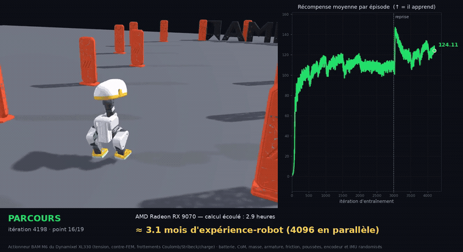

# Microduck RL sous Genesis : apprendre à marcher sur GPU AMD

**Français** · [English](README.md)

Portage sous **[Genesis](https://github.com/Genesis-Embodied-AI/Genesis)** de la
tâche de marche de **[pollen-robotics/microduck_rl](https://github.com/pollen-robotics/microduck_rl)**,
pour tourner sur **GPU AMD (ROCm)**.

Le **Microduck** est un bipède de ~800 g et ~25 cm, 14 servos Dynamixel XL330,
conçu par [Pollen Robotics](https://github.com/pollen-robotics/microduck). Le
dépôt amont entraîne ses politiques avec **mjlab (MuJoCo Warp)**, qui **exige
une carte NVIDIA**. Ce dépôt refait l'environnement sur Genesis, qui
tourne sur ROCm, **en conservant la recette sim2real amont**, parce que c'est
elle qui a de la valeur, pas le code.

---

## Démarrage rapide

Trois commandes, rien à installer sur le système :

```bash
./install.sh                                        # 1. l'environnement (conteneur isolé)
distrobox enter genesis-box                         #    puis, dans le conteneur :
source ~/venvs/genesis/bin/activate
python train.py -e smoke -B 64 --max-iterations 5   # 2. le smoke test (1 minute)
python train.py -e microduck-velocity -B 4096       # 3. l'entraînement
```

Suivre l'apprentissage : `tensorboard --logdir logs`.
Tout désinstaller : `./uninstall.sh --tout` (voir `--help`).

---

## Table des matières

1. [La démonstration](#1-la-démonstration)
2. [Installation](#2-installation)
3. [Utilisation](#3-utilisation)
4. [Le problème, en une mesure](#4-le-problème-en-une-mesure)
5. [Ce qui se transporte, ce qui se réécrit](#5-ce-qui-se-transporte-ce-qui-se-réécrit)
6. [Le cœur du sujet : l'actionneur](#6-le-cœur-du-sujet--lactionneur)
7. [Validation numérique du portage](#7-validation-numérique-du-portage)
8. [Sim2real : ce qui est garanti, ce qui ne l'est pas](#8-sim2real--ce-qui-est-garanti-ce-qui-ne-lest-pas)
9. [Ce qui est porté, ce qui ne l'est pas](#9-ce-qui-est-porté-ce-qui-ne-lest-pas)
10. [Résultats d'entraînement](#10-résultats-dentraînement)
11. [Structure du dépôt](#11-structure-du-dépôt)
12. [Invariants à ne pas casser](#12-invariants-à-ne-pas-casser)
13. [Écarts assumés avec l'amont](#13-écarts-assumés-avec-lamont)
14. [Crédits et licences](#14-crédits-et-licences)

---

## 1. La démonstration



▶ **[Extrait complet de 30 secondes](demo/microduck-parcours-30s.mp4)** :
l'arrivée au logo AMD et la chorégraphie finale, avec la courbe d'apprentissage
et le bandeau.

Robot à gauche, courbe d'apprentissage à droite qui se remplit au même rythme,
bandeau qui traduit le temps de calcul en expérience-robot : **2,9 heures de GPU
≈ 3,1 mois d'expérience-robot**, parce que 4096 robots s'entraînent en parallèle.

Le robot parcourt un couloir balisé de totems sur le relief d'entraînement
(bosses, pente, marches), puis exécute une courte chorégraphie devant le logo AMD.

**Ce que ça montre, et ce que ça ne montre pas.** La politique est aveugle :
elle ne voit ni les totems ni le relief. Le chemin est **commandé** de
l'extérieur par un suivi de points de passage qui écrit la commande de vitesse,
exactement comme un opérateur à la manette. La vidéo démontre la
**locomotion**, pas la navigation. La chorégraphie finale n'est pas non plus une
compétence apprise à part : ce sont des commandes de vitesse et de pose de tête
scriptées, exécutées par la même politique de marche, ce qui fonctionne sans rien
réentraîner parce que `head_pose` fait partie du contrat d'observation 61-D et
que la politique est entraînée à le suivre. Si le robot tombe, il est remis
debout au dernier point de passage et **le nombre de chutes est affiché dans le
bandeau**.

Le relief du parcours reprend les motifs de l'entraînement : bosses de 1 cm,
pente de 3,4° et marches de 0,8 cm, tous dans l'enveloppe apprise (l'entraînement
randomise les marches jusqu'à 1,5 cm et les pentes jusqu'à 5,7°), et
l'actionneur BAM avec ses frottements et ses saturations reste actif. Au rendu,
seules les perturbations d'entraînement sont coupées (poussées, randomisation,
bruit capteur) pour que la progression reste lisible.

## 2. Installation

Un Linux avec `distrobox` et `podman` (ou docker). Rien n'est installé sur le
système hôte : tout vit dans un conteneur.

```bash
sudo dnf install distrobox podman     # Fedora
sudo apt install distrobox podman     # Debian / Ubuntu
sudo pacman -S distrobox podman       # Arch
```

Puis, une seule commande :

```bash
./install.sh              # détecte AMD ou NVIDIA tout seul
./install.sh --amd        # force ROCm     (configuration TESTÉE)
./install.sh --nvidia     # force CUDA     (NON TESTÉE, voir ci-dessous)
```

Le script crée un conteneur depuis l'image officielle du fabricant (PyTorch GPU
est déjà compilé dedans), crée un environnement Python qui **hérite** de ce
PyTorch (surtout ne pas le réinstaller par pip, on récupérerait une build CPU),
installe Genesis et les dépendances épinglées, puis vérifie que le GPU est vu de
l'intérieur.

> **NVIDIA : non testé.** Le code ne dépend d'aucune API propre à AMD, donc ça
> devrait fonctionner, mais personne ne l'a vérifié. Il faut le NVIDIA Container
> Toolkit côté hôte. Si ça casse, la sortie de l'étape de vérification du script
> est le bon point de départ.

Désinstallation :

```bash
./uninstall.sh              # ce qui n'appartient qu'à ce dépôt
./uninstall.sh --partage    # + LE CONTENEUR et le venv commun (partagés !)
./uninstall.sh --image      # + l'image de base (~15-20 Go)
./uninstall.sh --tout       # tout : conteneur, venv, image
./uninstall.sh --tout -y    # idem, sans confirmation
```

Le conteneur et le venv portent des noms génériques : d'autres projets installés
de la même façon s'en servent peut-être. C'est pourquoi leur suppression demande
un drapeau explicite au lieu d'être emportée par une seule question « Continuer ? ».
Le script **énumère exactement ce qu'il va effacer** avant de demander
confirmation, et ne touche jamais à ton code ni à `logs/`.

Configuration de référence : Radeon **RX 9070**, ROCm 7.2.4, PyTorch 2.10,
Genesis 1.2.2, rsl-rl-lib 5.4.2, Python 3.12.

## 3. Utilisation

```bash
distrobox enter genesis-box
source ~/venvs/genesis/bin/activate
cd microduck_rl_genesis

# SMOKE TEST, toujours en premier. 5 itérations à 64 envs attrapent
# l'essentiel des erreurs de configuration pour quelques centimes.
python train.py -e smoke -B 64 --max-iterations 5

# Entraînement de la marche
python train.py -e microduck-velocity -B 4096

# Variante à jeu d'engrenage : ±1° de jeu en série sur chaque servo, encodeur
# lu à travers. Plus proche du vrai servo, donc plus dur, et plus transférable.
python train.py -e microduck-backlash -B 4096 --backlash

# Terrain accidenté (reprise depuis la marche : le relief se finetune, il ne
# s'apprend pas de zéro)
python train.py -e microduck-rough -B 4096 --rough \
    --resume logs/microduck-velocity/model_2999.pt

# Suivre l'apprentissage
tensorboard --logdir logs

# Rejouer une politique dans le viewer
python play.py -e microduck-velocity

# Exporter pour le robot (normaliseur cuit dans le graphe, chemin obligatoire)
python export_onnx.py -e microduck-velocity -o walk.onnx
```

## 4. Le problème, en une mesure

`microduck_rl` est bâti sur mjlab, lui-même bâti sur MuJoCo Warp. Le README amont
est explicite : *« Requires a CUDA GPU (training runs through MuJoCo Warp) »*.
Sur une Radeon RX 9070, la vérification tient en trois lignes :

```
warp 1.12.0  →  "Could not find or load the NVIDIA CUDA driver"
devices      :  ['cpu']
cuda devices :  []
```

`mujoco_warp` est CUDA seulement, sans voie de contournement : il tournerait en
CPU, donc inutilisable pour 4096 environnements parallèles. Le choix est binaire :
louer du NVIDIA, ou porter l'environnement sur un moteur qui parle ROCm.

Genesis parle ROCm. Et il charge les MJCF du Microduck sans retouche :

| Modèle | Chargement Genesis |
|---|---|
| `robot_walk.xml` | 20 DoF (6 libres + 14 servos), 15 links |
| `robot_allcollisions_rollers.xml` | 24 DoF (14 servos + 4 roues passives), 19 links |

Et surtout, **les masses sont identiques link par link** entre MuJoCo et
Genesis (0,73724 kg au total, écart nul) : les inerties de l'export Onshape sont
respectées. C'est le premier point sim2real critique, et il est acquis
gratuitement.

## 5. Ce qui se transporte, ce qui se réécrit

| Bloc | Statut |
|---|---|
| MJCF + meshes (26 Mo) | **repris tel quel** |
| PPO (`rsl_rl`) | **inchangé** : même bibliothèque, mêmes hyperparamètres |
| Recette de récompense, plages de DR, curricula | **repris valeur par valeur**, commentaires amont inclus |
| Contrat d'observation 61-D | **préservé à l'identique** |
| Actionneur BAM M6 | **réécrit** (l'amont dépend de `mujoco_warp`) |
| Environnement (managers Isaac-Lab-like de mjlab) | **réécrit** en classe Genesis |
| Capteurs (contact, temps de vol, hauteur de terrain) | **réécrits** (API différente) |
| Terrain accidenté | **réécrit** (boîtes mjlab → champ de hauteurs Genesis) |
| Export ONNX | **réécrit**, normaliseur cuit dans le graphe |

Le fichier [`microduck/velocity_cfg.py`](microduck/velocity_cfg.py) mérite un mot :
c'est **la recette**, et chaque valeur y garde le commentaire amont qui l'explique.
Ces commentaires ne sont pas de la documentation, ce sont des **cicatrices** :
chacun est le résultat d'un run raté. Exemple :

> `foot_slip` volontairement faible (−0,1 et pas −1,0) : −1,0 bridait trop le
> virage en pivot, qui est la façon dont ce robot tourne.

Ne pas changer une valeur sans lire le commentaire qui l'accompagne.

## 6. Le cœur du sujet : l'actionneur

> *« À cette échelle, de tout petits servos sous un bipède d'environ 800 g, la
> fidélité de l'actionneur est l'essentiel de l'écart sim→réel, et c'est
> pourquoi l'actionneur est modélisé jusqu'à sa loi de commande en tension
> plutôt qu'en PD idéal. »*
> (traduit du [README amont](https://github.com/pollen-robotics/microduck_rl#readme))

Le modèle est **[BAM](https://github.com/Rhoban/bam) M6** de Rhoban, ajusté sur
banc pour le Dynamixel XL330. Trois étages :

1. **Loi de commande firmware** : contrôleur P en position → rapport cyclique
   PWM → tension, avec le limiteur de courant modélisé comme une contrainte sur
   le rapport cyclique (le firmware ne peut agir que sur le PWM, pas synthétiser
   une tension arbitraire : à grande vitesse la contre-FEM rend la limite
   inatteignable, exactement comme sur le vrai servo).
2. **Couple moteur CC** : `τ = kt·V/R − kt²·q̇/R`.
3. **Budget de frottement** : Coulomb + Stribeck + terme dépendant de la charge,
   directionnel et quadratique.

Le point qui décide de la fidélité du portage est le troisième. Sous MuJoCo, BAM
n'injecte **pas** un couple de frottement passif : il écrit son budget dans
`dof_frictionloss`, et c'est le **solveur** qui fait l'écrêtage statique
(l'algorithme 1 de BAM). Or **Genesis implémente `frictionloss` exactement
pareil** : une contrainte à jacobienne identité, rangée dans `efc`. Le portage
peut donc être *identique* et non *approché* : le budget est écrit dans le modèle
à chaque pas physique, et Genesis fait le reste.

Cela impose une chose, et c'est un piège silencieux :
`RigidOptions(batch_dofs_info=True)`. Sans lui, `frictionloss` et `armature` sont
partagés par tous les environnements, et toute randomisation par env devient un
no-op invisible.

## 7. Validation numérique du portage

« Ça tourne » ne prouve rien. Chaque maillon est comparé à sa référence.

| Test | Ce qu'il prouve | Résultat mesuré |
|---|---|---|
| [`test_bam_formulas.py`](tests/test_bam_formulas.py) | loi firmware et couple moteur portés à l'identique | **bit-exact** (écart 0,000e+00 sur 2000 tirages) |
| [`test_external_torque.py`](tests/test_external_torque.py) | conventions de signe et indexation du couple externe lu dans Genesis | **3·10⁻⁹ N·m** d'écart avec MuJoCo |
| [`test_bam_vs_mujoco.py`](tests/test_bam_vs_mujoco.py) | boucle actionneur complète, deux pieds chargés au sol | **0,2°** d'écart à 0,3 s, sur des articulations qui bougent de 6,7° ; **0,2 mm** sur la hauteur du tronc |
| [`test_dr.py`](tests/test_dr.py) | la randomisation est par-env et ne s'accumule pas | ratios **exacts** (2,0000 / 0,5000) |
| [`test_obs_contract.py`](tests/test_obs_contract.py) | le contrat de déploiement 61-D, tranche par tranche, ordre des servos compris | conforme à [`SIM2REAL.fr.md`](SIM2REAL.fr.md) |
| [`test_backlash.py`](tests/test_backlash.py) | le jeu d'engrenage est borné et l'observation le lit à travers | jeu **1,015°** pour une spec de ±1° ; obs 61 / action 14 inchangées |
| [`test_onnx_deploy.py`](tests/test_onnx_deploy.py) | **la chaîne de déploiement entière** : l'ONNX qui partira sur le robot rejoue la politique sur de vraies observations, pas sur des vecteurs de test | **4,8·10⁻⁷ rad** d'écart sur 60 pas d'un épisode |
| [`smoke_env.py`](tests/smoke_env.py) | l'env se construit, avance, obs et récompenses finies | OK, sol plat et terrain accidenté |

Le troisième est le plus parlant : il fait tourner **le même robot, le même
actionneur, le même état initial** sous Genesis et sous MuJoCo, et compare les
trajectoires articulaires pendant que le robot est encore debout, et c'est là que
la boucle complète (loi firmware → couple → budget de frottement → écrêtage par
le solveur → contacts) est réellement mise à l'épreuve.

> Note : tenir la pose HOME en boucle ouverte est un **équilibre instable**. Les
> deux moteurs finissent par basculer, et le moment du basculement est
> chaotique. C'est pour ça que la comparaison s'arrête avant, et pas parce que
> ça arrangeait le résultat.

Lancer l'ensemble :

```bash
python tests/run_all.py
# Les deux tests qui comparent à BAM ont besoin du dépôt de référence :
git clone -b mjlab_frictionloss https://github.com/Rhoban/bam.git /tmp/bam
BAM_REPO=/tmp/bam python tests/run_all.py
```

## 8. Sim2real : ce qui est garanti, ce qui ne l'est pas

**L'objectif est explicite : ce qui est entraîné ici doit pouvoir être déployé
sur le vrai robot par le runtime de [pollen-robotics/microduck](https://github.com/pollen-robotics/microduck).**
Voilà où on en est, sans arrondir.

### Ce qui est identique à l'amont

- **Le contrat de déploiement.** Observation acteur 61-D dans l'ordre exact :
  48 de proprioception (`base_ang_vel(3)`, `projected_gravity(3)`,
  `joint_pos(14)`, `joint_vel(14)`, `actions(14)`) + 13 de commandes
  (`twist(3)`, `head_pose(4)`, `body_pose(6)`). Action = delta en radians autour
  de la pose HOME, 14 dimensions, **à 50 Hz**. L'ONNX produit ici entre dans le
  runtime amont sans modification.
- **La physique de l'actionneur** : BAM M6 XL330, validée numériquement (§7).
- **Le modèle du robot** : mêmes MJCF, mêmes masses, mêmes inerties, mêmes
  limites articulaires.
- **La randomisation de domaine** : 9 sources, aux plages de l'amont. Tension
  batterie (6,5-8,2 V) et sa chute sous charge, CoM du tronc et de la
  tête, masse et inertie, armature, frottement articulaire, friction de semelle,
  poussées, biais d'encodeur (±0,86°), désalignement de montage IMU (≤6°),
  retards bus (15-30 ms) et capteurs.
- **La normalisation d'observation cuite dans l'ONNX** : invariant amont, et le
  bug est invisible en simulation.

### Les limites, franchement

1. **Le moteur de contact n'est pas le même.** Genesis n'est pas MuJoCo.
   L'écart mesuré sur une seconde de marche est faible (§7), mais il n'est pas
   nul et il n'a pas été mesuré sur des dizaines de secondes de démarche
   entraînée. Une politique entraînée ici sera *proche* d'une politique
   entraînée sous mjlab, pas identique.
2. **Aucune validation sur robot réel n'a été faite ici.** Personne n'a encore
   déployé un ONNX produit par ce dépôt sur un Microduck physique. Tout ce qui
   précède dit que le contrat est respecté et que la physique est fidèle ; ça ne
   remplace pas un essai.
3. **La politique est aveugle.** Comme en amont : proprioception seule, ni
   caméra ni lidar. Elle ne peut pas éviter un obstacle qu'elle ne voit pas.
4. **Une seule des 13 tâches amont est portée** (voir §9), dans ses quatre
   déclinaisons : sol plat / terrain accidenté × avec ou sans jeu d'engrenage.

### Ce qui reste à faire pour un sim2real complet

- Déployer un ONNX sur le robot et mesurer l'écart réel.
- Rejouer un log du vrai robot dans les deux simulateurs et comparer
  (l'amont fournit `scripts/testbench_sim2real.py` pour ça).

## 9. Ce qui est porté, ce qui ne l'est pas

| Tâche amont | Ici |
|---|---|
| `Mjlab-Velocity-Flat-MicroDuck` (**la tâche principale**) | ✅ portée |
| `Mjlab-Velocity-Rough-MicroDuck` | ✅ portée |
| `Mjlab-Velocity-{Flat,Rough}-Backlash-MicroDuck` (jeu d'engrenage) | ✅ portée (`--backlash`) |
| `VelStand`, `StandUp`, `SitStand`, `GroundPick`, `BallKick`, `Roulade` | ❌ |
| Tâches rollers (`Velocity-Rollers`, `Swizzle`, `RollerCrouch`, `RollerSlope`, `RollerStandUp`, `Spin`) | ❌ |
| Variantes `-Backlash-` des autres tâches | ❌ (le mécanisme est là, il suit la tâche) |

Ce n'est pas un choix arbitraire : la tâche Velocity **est** le socle dont
toutes les autres héritent en amont (DR, observations, bruit, retards, gardes
NaN). L'infrastructure portée ici (actionneur BAM, randomisation, contrat
d'observation, terrain, export) est celle que les autres tâches réutiliseraient.

### Ce que coûterait vraiment « tout le dépôt amont »

Plutôt qu'un « c'est incrémental » vague, voici les chiffres, lus dans les
configurations amont et rapportés à la cadence **mesurée ici** (2,17 s par
itération à 4096 environnements sur RX 9070) :

| Tâche amont | Itérations amont | ≈ GPU à notre cadence | Ce qui bloque |
|---|---:|---:|---|
| `velocity` (portée) | 50 000 | 30 h | rien, elle est faite |
| `velstand` | 20 000 | 12 h | XML toutes-collisions + 9 fonctions `mdp` + 4 curricula |
| `standup` | 15 000 | 9 h | idem, + une init couchée |
| `sitstand` | 15 000 | 9 h | idem |
| `ground_pick` | 20 000 | 12 h | XML dédié + préhension |
| `ball_kick` | 10 000 | 6 h | XML toutes-collisions + ballon |
| `roulade` | 10 000 | 6 h | XML toutes-collisions |
| `velocity_rollers`, `spin`, `roller_crouch`, `roller_slope`, `roller_standup` | 8 000 – 50 000 | 5 – 30 h | XML rollers (roues passives) |

Soit de l'ordre de **120 heures de GPU** pour l'ensemble, sans compter les
itérations de mise au point, et les commentaires amont montrent que chaque
tâche a demandé plusieurs campagnes ratées avant de converger (le seul
`velstand` documente sept « runs » successifs). Tous les XML nécessaires sont
déjà dans le dépôt amont : ce qui manque est du câblage, pas des assets.

### Et sur la tâche portée elle-même

> **À savoir.** L'amont entraîne Velocity sur **50 000 itérations**. La campagne
> menée ici en fait **3000** (sol plat) puis 1200 en reprise sur terrain
> accidenté, environ **2 h de GPU au lieu de 30**. La politique obtenue marche
> et tient 944 pas sur 1000, mais ce n'est pas la même maturité qu'un run
> complet : sur le robot réel, attends-toi à une marge de robustesse plus
> faible que ce que produirait le budget amont. Le portage n'est pas en cause,
> c'est un choix de temps de calcul, et il se rattrape en relançant
> `train.py` avec `--max-iterations 50000` et `--resume`.

## 10. Résultats d'entraînement

Trois campagnes sur une seule RX 9070. Terrain accidenté et jeu d'engrenage sont
**repris** de la politique de marche : le relief et le jeu se finetunent, ils ne
s'apprennent pas de zéro.

| Run | Tâche | Repris de | Itérations | Récompense finale | Durée d'épisode | Temps GPU |
|---|---|---|---:|---:|---|---:|
| `microduck-velocity` | marche, sol plat | de zéro | 3000 | 108,8 | **944 / 1000 pas** | 1 h 49 |
| `microduck-rough` | terrain accidenté | `microduck-velocity` | 1200 | 125,2 | **962 / 1000 pas** | 1 h 03 |
| `microduck-backlash` | jeu d'engrenage ±1° | `microduck-velocity` | 1200 | 121,9 | **961 / 1000 pas** | 1 h 06 |

### Comment lire la courbe de récompense

Deux choses surprennent, et aucune n'est une régression.

**Le décrochage à la reprise n'en est pas un.** `Train/mean_reward` est une
**somme sur l'épisode**, pas une moyenne par pas. Juste après une reprise, les
épisodes n'ont que quelques pas de vie : la somme est petite parce qu'elle porte
sur peu de pas, pas parce que la politique serait devenue mauvaise. Les chiffres
le disent sans ambiguïté : la récompense par pas est constante du premier point
au dernier :

| Itération | Récompense | Durée d'épisode | Récompense / pas |
|---:|---:|---:|---:|
| 2999 (reprise) | 1,66 | 12,7 | 0,131 |
| 3017 | 64,92 | 439 | 0,148 |
| 4198 (fin) | 124,1 | 963 | 0,129 |

**Les creux en cours de route sont attendus.** Le curriculum de terrain durcit
le sol au fil du temps, les curricula de randomisation élargissent leurs plages,
et PPO continue d'explorer. Une récompense qui stagne pendant que les conditions
se durcissent est une progression.

Le signal à suivre pour « est-ce que ça marche » n'est pas la récompense mais la
**durée d'épisode** : 944, 962 et 961 pas sur 1000. C'est elle qui dit que le
robot reste debout.

## 11. Structure du dépôt

```
microduck/
├── assets/microduck/     MJCF + meshes, copiés de l'amont (CC BY-SA-NC)
├── assets/xl330_m6.json  paramètres BAM M6 ajustés sur banc pour le XL330
├── constants.py          ordre des 14 servos, pose HOME, découpe d'obs, config BAM
├── bam_actuator.py       actionneur BAM vectorisé + buffer de retard
├── terrain.py            champ de hauteurs accidenté + lecture de hauteur
├── velocity_cfg.py       LA RECETTE : poids, plages de DR, curricula
└── velocity_env.py       l'environnement Genesis

train.py  play.py  export_onnx.py    entraîner, rejouer, exporter
tests/                              la suite de validation du portage
policies/                           politiques ONNX prêtes à déployer
demo/                               l'extrait de 30 s et son aperçu animé
install.sh  uninstall.sh            environnement conteneurisé, AMD et NVIDIA
```

Le dépôt se limite volontairement à ce qui sert le portage, sa validation et le
déploiement sur le robot. L'outillage de production des vidéos et
d'enchaînement de la campagne est gardé en dehors.

## 12. Invariants à ne pas casser

Repris de l'`AGENTS.md` amont ; ils survivent au changement de moteur.

- **L'observation acteur fait 61 dimensions**, dans l'ordre de
  `constants.OBS_LAYOUT`. C'est ce qui permet au runtime embarqué de permuter les
  politiques à chaud. Un slot de commande inutilisé se met à **zéro**, il ne se
  supprime jamais.
- **Ordre des 14 servos** : 0-4 jambe gauche, 5-8 nuque/tête, 9-13 jambe droite.
- **La normalisation d'observation est active** → elle doit être cuite dans
  l'ONNX. `export_onnx.py` le fait ; en simulation, l'oubli est invisible.
- **Les politiques ne sont pas filtrées** (pas de passe-bas sur l'action à
  l'entraînement). En ajouter un sans le drapeau correspondant côté runtime casse
  le transfert, dans un sens comme dans l'autre.
- **La randomisation ne doit pas s'accumuler d'un reset à l'autre**
  (`tests/test_dr.py` le vérifie ; un randomiseur de CoM accumulant a dégradé
  des mois de runs en amont).
- **`batch_dofs_info=True`** dans les options Genesis, sinon toute la
  randomisation par env est un no-op silencieux.

## 13. Écarts assumés avec l'amont

**Frottement quadratique.** Le modèle BAM de référence (`bam/model.py`) n'active
son terme quadratique que lorsque couple moteur et couple externe sont de signes
**opposés**. Le portage mjlab (`bam/mjlab.py`), celui qui a réellement entraîné
les politiques déployées sur le vrai robot, a perdu cette garde. Écart mesuré :
**1,5 % au pire** sur le budget de frottement. Ce dépôt reproduit **mjlab** par
défaut, pour rester sur la recette qui transfère ;
`BamActuator(..., quadratic_sign_gate=True)` remet la version du papier.

**Repères de pied.** Genesis n'expose pas les `<site>` MJCF. La pose des repères
de pied est recomposée depuis le repère du link cheville et l'offset lu dans le
XML (`constants.FOOT_SITE_OFFSETS`).

**Hauteur du pied au-dessus du sol.** mjlab lance un rayon
(`TerrainHeightSensor`). Ici le champ de hauteurs est conservé côté Python et
interpolé bilinéairement : même grandeur, sans raycast.

**Terrain accidenté.** mjlab empile des boîtes, Genesis prend un champ de
hauteurs. Les **amplitudes verticales sont conservées** ; les parcelles sont plus
petites (3 m au lieu de 8 m, le robot plafonnant à 0,4 m/s) et la grille plus
réduite (10×10 au lieu de 10×20), parce que Genesis construit une SDF sur tout le
terrain et que 2,2 M cellules ne se compilent pas. Ce n'est pas une perte : les
environnements Genesis sont des mondes **indépendants** partageant la même
géométrie statique, donc la variété vient du placement des origines.

**Moment angulaire.** Pas de capteur `subtreeangmom` dans Genesis : il est calculé
depuis les vitesses et inerties des links.

**Performance.** `set_dofs_armature` coûte **1,7 s par appel** sous Genesis
1.2.2, avec ou sans `envs_idx` : changer l'armature invalide la matrice de
masse, que Genesis refactorise. Appelé à chaque reset, il multipliait par 6 le
temps d'itération. Les setters voisins (`set_dofs_frictionloss`,
`set_dofs_damping`) sont à 0,02 ms ; le problème est propre à l'armature. La
randomisation d'armature est donc tirée une fois par environnement au démarrage
et tenue pour tout le run, ce qui est aussi le choix physiquement honnête :
l'inertie rotorique d'un servo ne change pas entre deux épisodes.

## 14. Crédits et licences

- **[pollen-robotics/microduck_rl](https://github.com/pollen-robotics/microduck_rl)**
  fournit le robot, les modèles 3D, et surtout **la recette sim2real** que ce
  dépôt se contente de transporter. Code sous Apache 2.0.

  > **Ce dépôt a deux licences.** Les MJCF et maillages de
  > `microduck/assets/` conservent leur licence amont, **Creative Commons
  > BY-SA-NC**, et ne sont pas couverts par Apache 2.0. Si tu les réutilises :
  > créditer Pollen Robotics, garder les dérivés sous la même licence, et
  > savoir que l'usage commercial n'est pas accordé. Le code, lui, est sous
  > Apache 2.0 et ne porte aucune de ces conditions.
- **[Rhoban/bam](https://github.com/Rhoban/bam)** : le modèle d'actionneur BAM
  (Marc Duclusaud & Grégoire Passault). Apache 2.0.
- **[mjlab](https://github.com/mujocolab/mjlab)** : le cadre d'entraînement amont,
  dont la sémantique a servi de référence.
- **[Genesis](https://github.com/Genesis-Embodied-AI/Genesis)** : le moteur de
  simulation utilisé ici.
- **[rsl_rl](https://github.com/leggedrobotics/rsl_rl)** : l'implémentation PPO.

Le logo AMD qui apparaît dans la vidéo signale simplement que l'entraînement
tourne sur GPU AMD. C'est une marque déposée d'Advanced Micro Devices, Inc. ; ce
projet n'est ni affilié à AMD ni approuvé par AMD.

**Licence de ce dépôt, en deux lignes :** le code est sous **Apache 2.0**, comme
l'amont dont il dérive ; les modèles 3D de `microduck/assets/` restent sous
**CC BY-SA-NC** et ne sont pas couverts par Apache 2.0. Le détail est dans
[`LICENSE`](LICENSE), [`NOTICE`](NOTICE) et
[`microduck/assets/LICENSE-ASSETS.md`](microduck/assets/LICENSE-ASSETS.md).
