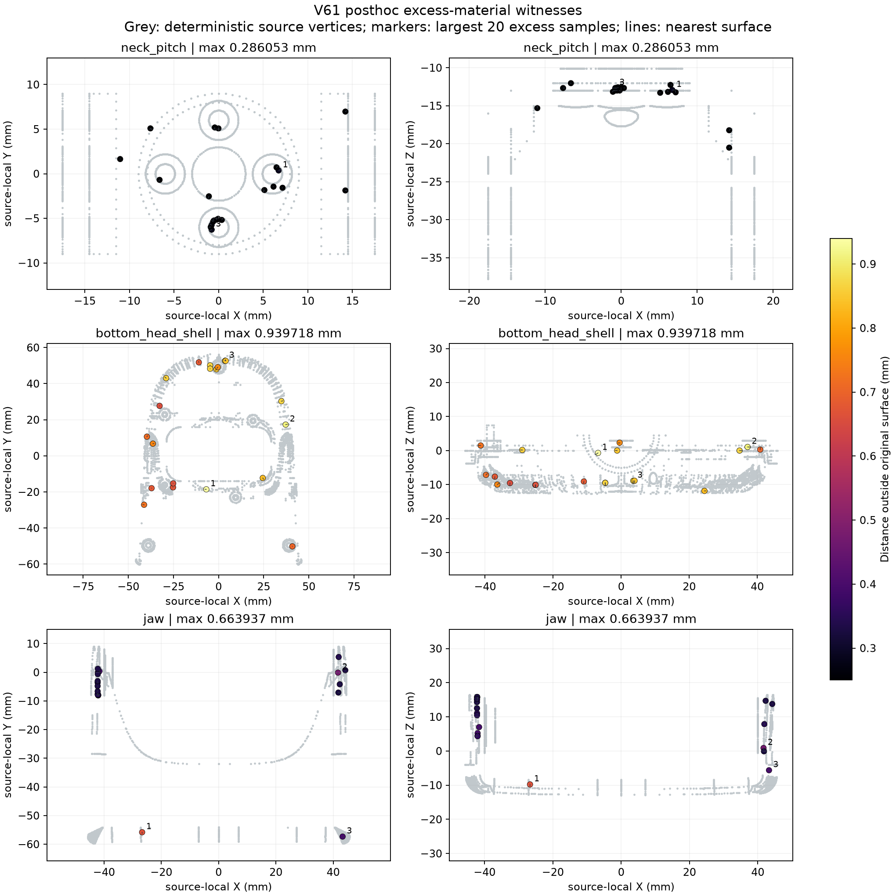

> Historical execution record. Subsequent V62–V66 results and the current
> review priority are summarized in the [process-review packet](PROCESS_REVIEW_20260916.md).
> The proposed next steps below describe the decision at the time of this record.

# Collision geometry follow-through — September 16, 2026 UTC

The neck bracket, bottom head shell and jaw now pass the unchanged 0.25 mm
sampled material limit, alongside the unchanged retained bearing. All eight
cavity checks and 4,664,668 additional surface samples pass. The complete
7,592-collider robot passes its frozen compiler, parameter, contact and 201-pose
audit. The geometry prerequisite is complete. Dynamic, walking and physical
calibration acceptance remain separate.

## Subsequent V64 isolation

V64 completes 28 analysis cases with 33,616 verified physics steps. Physical-export
matching and a diagnostic mask on just two shell/floor pairs both still fall.
Finer integration also destabilizes the original recorded-action replay; no
finest-step agreement screen passes. The next investigation is BAM force-feedback
timing and first sole contact, with standing-policy startup still queued. The
geometry result below is unchanged. The stopped premature launch and fresh
counterfactuals are explicitly retained in the
[V64 results](../../experiments/walking/contact-isolation-v64/README.md).

## Subsequent V63 dynamics

The startup/load sequence has now been executed. Both retained V11 replays match
exactly, but fixed HOME falls on both models, V62 passive settling stops on
10.336 mm floor penetration at 0.540 s, and V62's frozen-action replay falls at
2.505 s.
The static V62 result is unchanged; no full-model dynamic or walking admission
follows. All 11,412 recorded physics samples are independently checked. The next
active investigation is foot-shell/floor contact and contact/integration response.
See [V63 results](../../experiments/walking/startup-load-v63/README.md).

## V62 geometry result

| Component | Convex parts | Excess, mm | Missing, mm | Additional-sample maximum, mm |
|---|---:|---:|---:|---:|
| Bearing, retained | 256 | .177181 | .000439 | .209354 |
| Neck bracket | 614 | .158010 | .001311 | .197737 |
| Bottom head shell | 4,875 | .085166 | .004684 | .217406 |
| Jaw | 1,781 | .147827 | .007645 | .190696 |

All values use the versioned unit-stable distance checker. The original bank
covers 32,204 source points and 203,644 proxy points; additional samples use
all face centroids, quarter-edge points and unused interior barycentric points.
All 80 worst additive witnesses agree with independent all-triangle analytic
distances within 1 nm. Every part is convex and watertight. These are sampled
CAD comparisons, not a global error bound or measured physical calibration.

The original evaluator's .313744 mm shell failure is preserved separately.
Exact localization and analytic triangle calculations show all eight apparent
over-limit points are numerical errors: the worst is actually .000076 mm from
the CAD. The corrected evaluator changes internal query units from metres to
millimetres and converts results back. Sample locations, the .25 mm limit,
1 nm convex-boundary epsilon and cavity rules remain fixed. Nine unchanged
contract cases and three independent scale regressions pass, including a
real .3 mm error that still fails. Old negative scores are not overwritten.

The bracket and jaw use source-solid intersection and bounded partitioning;
the difficult shell uses source-clipped local CoACD followed by residual
partitioning. Several explicit failed attempts and budget amendments are
retained. The final shell preserves completed regions through hash-verified
reuse, with all 256 source parents accounted for. The complete bearing archive
stays byte-identical. CoACD coverage is approximate and therefore checked
independently rather than inferred from its lineage.

The four-worker checker gives an exactly identical bracket result in 19.9 s
versus 70.6 s for serial execution. This single observed comparison establishes
result equivalence and useful local speedup, not a hardware benchmark. All
attempts have deadlines and process cleanup; the interrupted serial shell
scan remains explicitly partial. Full details and receipts:
[V62 source-aware refinement](../../experiments/walking/contact-reconciliation-v57/surface-refinement-v62/README.md).

## Complete assembly

All 62 checked physical and actuator arrays match the V57 full-CAD reference
exactly. Body/joint/actuator ordering, unique geom names, contact parameters and
both power-support/leg pairs are preserved; there are no explicit exclusions.
The largest compiled world-vertex difference is 2.884309 nm against 100 nm.
All 201 frozen copied poses show zero recorded internal penetration, compared
with the original full-hull model's 201/201 poses above 1 mm.

The full assembly contains 7,526 proxy geoms and 7,592 active robot colliders.
Its 28,815,436-row contact-pair matrix and other bulk artifacts are on the
UUID-verified `cerebro-old` volume through a stable repository link. The geometry
probe takes 138.4 seconds; it runs kinematics and collision detection only,
with zero dynamic steps. Per-step runtime is still unmeasured. Complete results:
[assembly receipt](../../experiments/walking/contact-reconciliation-v57/surface-refinement-v62/assembly/result.json)
and [integrity review](../../experiments/walking/contact-reconciliation-v57/surface-refinement-v62/assembly-review.json).

## Preserved V59–V61 sequence

| Stage | Measured result | Decision |
|---|---|---|
| [V59 compiler probe](../../experiments/walking/contact-reconciliation-v57/proxy-diagnostics-v59/README.md) | One mesh-inertia attribute change fixes compilation; 62 checked physical/actuator arrays match exactly; 256 proxy vertex clouds stay within 3.740 nm of their source locations; 201 copied poses have no internal overlap. | Compiler compatibility is established for this diagnostic. V58 material failures remain. |
| V59 independent material checks | All 44 compared V58 metric fields reproduce exactly; all eight cavity-point checks pass; nine synthetic tests pass. | Geometry checks now survive an individual mesh/input failure and do not depend on model compilation. |
| [V60 bearing](../../experiments/walking/contact-reconciliation-v57/bearing-hull-cap-v60/README.md) | Changing the hull cap from 64 to 256 reduces sampled excess from .343090 to .217129 mm; missing material .162090 mm; every part convex/watertight. Assembly preserves all checked arrays. | Keep this passing component. The partial robot still has unrepaired head shapes. |
| [V61 remaining shapes](../../experiments/walking/contact-reconciliation-v57/head-hull-cap-v61/README.md) | At the same 256-part cap, excess remains .286053 mm for bracket, .939718 mm for shell and .663937 mm for jaw. | All three fail the .25 mm limit. No complete-model assembly or dynamic run follows. |

The combined V61 material bank checks 32,204 source samples and 51,310 proxy
samples across 1,024 parts. All parts are convex and watertight; all missing
material and original cavity-point checks pass. These are sampled diagnostics,
not global geometric bounds, applied-contact loads or physical calibration.
The passing bearing record repeats exactly in the combined bank.

Generation and evaluation were serialized with fixed process deadlines. There
was one cap-change attempt per mesh, with no parameter sweep, timeout or retry.
All four original V58 failures and the original retained walking policies remain
unchanged. The library's hardware-concurrency threading is not an OMP thread
cap, and measured elapsed times are not a controlled performance benchmark.

## Earlier failure localization

The separately recorded [excess-material witnesses](../../experiments/walking/contact-reconciliation-v57/head-hull-cap-v61/excess-witnesses.json)
exactly reproduce all three failed maxima. The bracket has only three violating
samples across parts 152 and 192; the shell has 192 across 101 parts, and the
jaw 49 across 25 parts. Of the 244 violations, 243 are face centroids and only
one is a vertex. This supports investigating faces spanning CAD recesses;
it does not establish a semantic feature diagnosis or global error bound.

These witnesses led to V62's source-aware partitioning, preserving the bearing
and the .25 mm limit. V62 is a new representation, with its own frozen banks
and candidate evidence; the V61 results above remain historical negatives.

The posthoc witnesses are diagnostic coordinates and part identities. They
cannot repair V61's score retroactively.

The figure shows the largest 20 positive-excess samples per mesh, not only
over-limit points. In the bracket panels, only three of those samples exceed
.25 mm. Grey points are original CAD vertices; projections are not contact
or dynamic evidence.

## Dynamic verification after the geometry gate

**This sequence was executed in V63 above.** The frozen short, distinct controlled-HOME,
passive-zero-motor-torque and retained-action BAM probes exposed dynamic failures.
The new active step is their foot/contact diagnosis; longer training and terrain
tests remain downstream of that check.

V63 used the existing exact-action replay pattern in
[`probe_matched_contact_v31.py`](../../scripts/probe_matched_contact_v31.py)
in a separately versioned driver around `EvaluatorCore`, with a frozen candidate
scene/floor and fresh BAM/controller state for each case. It preserved 14 ordered
action deltas, 50 Hz control, four 5 ms physics steps per control, the declared
target-delay FIFO and exact retained float32 action bytes. Applied contact loads
were read after each `mj_step`; copied-state kinematic force estimates did not
replace those observations.

V63 addressed three implementation pitfalls before launch:

- `TerrainWorld.step_command` rejects action overrides and expects V11 physical
  arrays. The upstream full-CAD reference has separately recorded export
  differences, so V63 used an explicit versioned model path.
- Full-CAD sole names differ from the current gait probe's hard-coded names.
  V63 declared a mapping and kept other foot/ankle contact classes distinct.
- Zero-action BAM holds HOME actively. A zero-torque passive probe has a
  different motor/friction definition. V63 reset included BAM-mutated model
  state, previous torque and FIFO state; each case started from a fresh model.

Exact-action replay, closed-loop walking and physical acceptance remain distinct.
The current actor pair and V30 heading stay retained. No new claim about
carpeting, endurance, recovery or real-world transfer follows this work.

## Verification

The fast workspace suite passes all 141 tests; all 36 V62 tests pass, including
12 corrected-checker contract/numerical cases. Source bindings, exact regression fields and
compiled geometry/parameter checks are retained in the stage receipts. The
workspace viewer's existing 24 symlink-inspection errors remain separate from
direct artifact verification. No paid instance, hardware operation, policy
activation or new training run was used.

`TRAINING_ACTUALIZATION.md` remains the ordered task list and `GOAL.md` the
current status. No new role-cycle records or autonomous loops were created.
