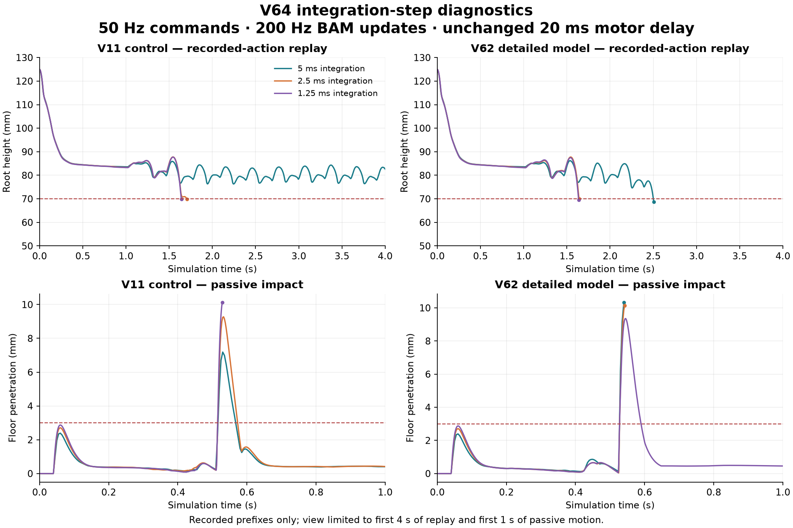

# V64: contact isolation and integration response

**The bounded investigation is complete; neither isolated model change rescues
the recorded walk, and numerical agreement remains unresolved.** There are 28
verified cases, 33,616 recorded physics steps and 14 byte-identical repeat pairs.
All eight controls exactly reproduce their V63 initial states and dynamics.
Both V11 controls also reproduce the original 18-second replay. No case passes
every new diagnostic gate, and no model or behavior is admitted.

## What the contact isolation establishes

| V62 replay variant | End time, both repeats | Result |
|---|---:|---|
| Original full geometry | 2.505 s | Falls; floor penetration and nonsole support fail. |
| Body/inertial/joint XML matched to V11 | 2.505 s | All 27 declared physical/actuator arrays match V11; replay still falls. |
| Only the two foot-shell/floor pairs disabled | 2.485 s | Replay still falls. All other mask-compatibility decisions are preserved; no explicit pairs or exclusions are introduced. |

The export intervention changes the trajectory by up to 5.024 mm over its common
prefix; the shell mask changes it by up to 6.462 mm. Neither is sufficient to
recover the reference replay. These separate interventions do not test their
combined interaction. The masked model is diagnostic only and cannot be admitted.

The mask variant exactly matches the unmodified full model's states, targets and
torques before the first generated shell/floor contact at 0.055 s. That early
contact carries no positive normal force. The first contacts loaded above 0.1 N
remain the previously observed left/right events at 1.475/1.630 s. Contact-list
membership and loaded support are different observations.

Original CAD and compiled plane-support extrema agree in all 16 copied-state
checks. At the first loaded left shell event, the sole reaches −2.140 mm and
the shell −0.145 mm; on the right they reach −2.024 and −0.029 mm. The shells
are about 2 mm above the sole surfaces in these poses, so simulated sole
penetration reaches them. This supports investigating contact response; it
does not prove the physical sole compresses that far.

## Integration-step results

| Model and probe | 5 ms | 2.5 ms | 1.25 ms |
|---|---|---|---|
| V11 recorded actions | Completes 18 s | Falls at 1.705 s | Falls at 1.64125 s |
| V62 recorded actions | Falls at 2.505 s | Falls at 1.6425 s | Falls at 1.63625 s |
| V11 passive | Completes 5 s; penetration/joint limits fail | Completes 5 s; penetration/joint limits fail | Hard stop at 0.52875 s; exceeds 10 mm floor penetration |
| V62 passive | Hard stop at 0.540 s | Hard stop at 0.5425 s | Completes 5 s; floor/internal penetration and joint limits fail |

Each entry has two identical dynamics histories. Commands remain at 50 Hz,
BAM/friction updates at 200 Hz, and motor target delay at 20 ms. Every action is
the original float32 tensor value; the finer physics steps hold target, torque,
friction and damping until the next BAM update. There is no added filtering,
clipping, IK, rescue or policy inference on the changed state.

None of the four model/probe comparisons passes the preregistered finest-step
agreement screen. For replay, the 2.5 versus 1.25 ms runs differ by up to 7.689 mm
in V11 root position and 11.007 mm in V62, above the 1 mm screen. Their joint
differences also exceed 1 degree. Similar fall times alone cannot override those
differences. The passive cases also change terminal category. The underlying
3 mm floor threshold remains unchanged, including its rejection of the original
18-second V11 replay; historical V30 scores are not rewritten.

`comparison.json` retains peak differences over each entire observed prefix and
state differences over the common coarse-time grid. The separately labeled
`posthoc-common-prefix.json` also compares penetration peaks over equal observed
duration. It does not change thresholds or convert any agreement/behavior result
to a pass.

Instrumented V62 replay control p99 rises from 2.224 ms at the original step to
4.766 and 7.719 ms at the finer steps in repetition one, but all are incomplete
prefixes. The full 1.25 ms passive case has control p99 of 128.540–130.025 ms and
misses the 20 ms budget in 6/250 intervals in each repeat. These include BAM,
physics and observation work, excluding file encoding; raw physics and setup
timings are separate. No sustained real-time performance gate is admitted.

## Solver and actuator interpretation

Every recorded contact uses the same parameter set: solref `[0.02, 1]`, solimp
`[0.9, 0.95, 0.001, 0.5, 2]`, dimension 3, zero margin and friction
`[1, 1, 0.005, 0.0001, 0.0001]`. The model uses Euler integration, Newton solving,
pyramidal friction, 100 solver iterations and tolerance 1e-8. No stiffness,
friction, solver setting or integrator type was changed.

MuJoCo's positive contact time constant controls softness and is constrained
relative to the integration step; preserving it does not make contact stiffness
measurement-based. These values are defaults, not a robot calibration.
[Official solver guidance](https://mujoco.readthedocs.io/en/stable/modeling.html#solver-parameters).

Source inspection reveals an additional coupling: the pinned BAM controller uses
current joint state alongside retained solver force fields to calculate friction.
After a physics step, those force fields come from the preceding solver state.
Subdividing integration changes their nominal age at the next BAM update from
5 ms to 2.5 or 1.25 ms, even though the BAM update period stays fixed. This is a
source/pipeline inference, not an experimentally isolated cause. The controller's
input force vectors were not separately recorded in V64. The timestep comparison
therefore measures the coupled integration/BAM response, not solver error alone.
See `bam-feedback-phase-audit.json` and pinned `.workspace/bam/bam/mujoco.py`.

The original sole CAD also merits careful separation from file hashes. The left
sole's unique vertex sets are identical. The right sole files have different
tessellation/vertex sets, but mutual convex-hull facet excess is at most 6.289 nm
in a posthoc comparison. A 0.696 mm nearest-vertex difference is not a 0.696 mm
surface error. These source checks do not establish compiled contact equivalence.

## Next activity

**Isolate BAM force-feedback timing and the first sole contact before choosing
a new numerical reference or retraining.** Freeze two small diagnostics:

1. Record the generalized-force inputs and their solver timestamps at every BAM
   update. Compare native retained-force timing with an explicitly fixed physical
   age, using a controller-input snapshot that leaves physical solver data intact.
   First require exact reproduction of the 5 ms control. Keep command, motor
   delay, BAM update rate, action bytes and contact parameters unchanged.
2. At the first sole impact, use matched compiled contact geometry and inertial
   state in a bounded drop/rocking probe. Separate contact response from the
   actuator feedback update, then test numerical agreement before selecting a
   timestep or modifying contact softness.

The standing-policy startup handoff remains queued behind this unresolved model
question. Open-loop replay failure does not by itself score a live closed-loop
policy, and these diagnostics do not establish physical or carpet readiness.

## Execution integrity and retained deviation

An orchestration error launched the first isolation plan before the read-only
control review finished. Two export-match cases completed and a shell-mask case
was interrupted during setup. All three attempts are retained and quarantined;
they are excluded from the 28 verified cases and comparisons. The fourth original
isolation case never launched. No hypotheses, thresholds, actions or durations
changed in `bank-r2.json`; it gives the four isolation cases fresh IDs after the
controls passed. See `sequencing-deviation.json` and both process reports.

The initial read-only reviewer repeatedly decompressed NPZ members per row.
Its retained successor loads each array once; both completed control reviews
pass. This reader change does not alter simulator output or acceptance criteria.

All 28 retained analysis cases exit without timeout or execution
error. Each has a 240-second deadline. Seven focused isolation tests and all 141
workspace tests pass. Every action, FIFO target, integration clock, held BAM
output, contact-load sum, state-array correspondence and repeat is independently
checked. The UUID-verified external drive holds the bulky run files. No paid
compute, hardware operation, policy activation or training was used.

Evidence entry points: `bank-r2.json`, `geometry-audit.json`,
`controls-review-r2.json`, `all-review-r2.json`, `comparison.json` and
`runs/<case>/result.json`. Execution and evidence integrity never override a
failed diagnostic component.
