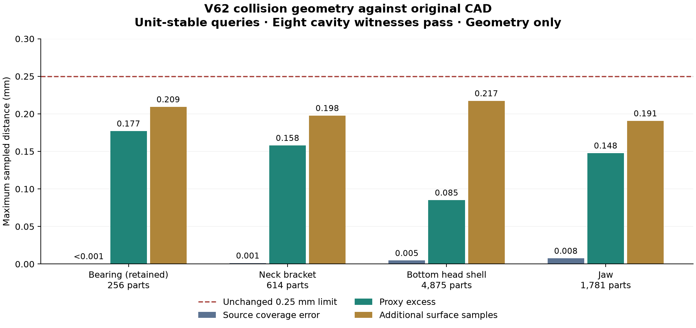

# V62 source-aware collision refinement

This is a development representation experiment against the exact retained CAD.
It does not change the CAD, physical arrays, controllers or acceptance tolerance.
The V60 bearing archive remains retained byte for byte. V58–V61 evidence remains
unchanged. All scoped material, cavity, compiler and copied-pose gates pass. Each stage
retains its own result; dynamics and physical acceptance remain separate.

## Current geometry result

All four materials pass the versioned unit-stable checker and all eight original
cavity checks. The independent additive bank passes 4,664,668 points; its 80
worst-distance witnesses agree with all-triangle analytic calculations within
1 nm. The full assembly passes every frozen compiler/contact gate; all 201 copied
poses have zero recorded internal penetration.

| Component | Parts | Sampled excess, mm | Sampled missing, mm | Additive excess maximum, mm |
|---|---:|---:|---:|---:|
| Retained bearing | 256 | .177181 | .000439 | .209354 |
| Neck bracket | 614 | .158010 | .001311 | .197737 |
| Bottom head shell | 4,875 | .085166 | .004684 | .217406 |
| Jaw | 1,781 | .147827 | .007645 | .190696 |

Every distance limit remains .25 mm. The original point bank covers 32,204 source
points and 203,644 proxy points. Every piece is watertight and convex. These are
sampled results against the retained CAD, not a certified global approximation
bound or measurement-based physical calibration. The table uses the corrected
query implementation throughout; old V59 raw metrics remain separate receipts.

All 768 original V61 parent regions are accounted for. The bracket/jaw preserve
395 untouched parent arrays by value and conserve each exact source partition;
the shell preserves 48 original parents and all 208 local hybrid-region archives.
Its 4,575 unrefined local pieces match exactly, with 14 local source partitions.
The hybrid lineage review explicitly does not claim CoACD source conservation;
its approximate coverage is judged by the independent missing-material check.

## Frozen intervention

Intersect selected V61 convex regions with the original source solid. Preserve
every nonempty connected component, construct its convex hull, and recursively
split failing hulls along the longest coordinate extent. Select using all
vertices, face centroids, edge midpoints and three interior face points, with
0.18 mm selection and 0.12 mm refinement targets. Also include the two localized
bracket parents 152 and 192. Initial limits are depth 16, 128 leaves per parent
and 4,096 parts per mesh. The separately frozen shell r6 amendment increases
only its local allowance to 1,024, after a 34.7 mm wall required more than 128;
the same 4,096 total cap and all accuracy thresholds remain. Each source-bound
protocol has one attempt and a coordinator-enforced deadline. The adaptive
attempts below are preserved, not presented as one successful first attempt.

Manifold 3.5.3 is installed only in ignored `.workspace/geometry-deps-v62/site`;
the binary and package metadata are hashed in the protocols. It supplies
double-precision solid intersection and plane partitioning. The API provenance
is the [library documentation](https://github.com/elalish/manifold/wiki/Manifold-Library)
and [Python distribution](https://pypi.org/project/manifold3d/). Original STL
hashes, prior archives, generator code, and validator code are bound separately.

## Preserved first-attempt failure and numerical correction

The initial bracket attempt exhausted its 128-piece local budget before
completing the first parent; it produced no candidate archive. Its source and
receipts remain frozen as `bracket-protocol.json` and `bracket-processes.json`.
Investigation found that Trimesh's absolute tolerances in triangle distance
calculations can misclassify tiny metre-scale triangles. In a synthetic closed
box, a point exactly on a face was reported 0.035355 mm away. Unit-normalized
queries return zero and still correctly reject a genuine 0.3 mm excess.

Revision r2 changes only the refinement's distance-query units to millimetres,
then converts distances back to metres. Source, proxy coordinates, budgets and
physical thresholds remain unchanged. The three V61 failures are still real:
unit-normalized distances at the retained worst witnesses remain approximately
0.284 / 0.937 / 0.664 mm. This correction does not relabel the old results.

The analytic box reproduction is retained in `scale-regression.json`. The
analytic plane-and-edge calculation agrees with the corrected distances.

## Recorded development branches

| Attempt | Result |
|---|---|
| Initial bracket | Local budget exhausted; no candidate archive. |
| Bracket r2 | 614 parts; unchanged material check passes (.176571 mm excess, .185453 mm missing); all 177,268 additive samples pass (.197737 mm maximum), with 20 analytic witness agreements. |
| Shell r2 | Local budget exhausted on parent 2; no candidate archive. |
| Jaw r2 | 1,781 parts; original material check passes; all 830,572 additive samples pass (.190696 mm maximum), with 20 analytic witness agreements. |
| Shell r3/r4 | CAD-face cuts expose degenerate source partitions; both rejected before candidate export. |
| Shell r5 | Moving cuts into the witnessed gap avoids coincident planes but exhausts depth; no candidate archive. |
| Shell r6 | The local wall completes, but the mesh exceeds the unchanged 4,096 total-piece limit after 566.6 seconds. No full candidate archive. |
| Local CoACD pilot | 64 pieces replace the difficult wall but .283713 mm excess fails the pilot; .001994 mm sampled missing material. |
| Local hybrid pilot | Refining only residual CoACD errors gives 139 pieces, .168329 mm excess and .001994 mm missing; the pilot passes. |
| Shell r7 | Local hybrid refinement reaches 4,107 pieces and exceeds the 4,096 total cap; completed source-bound regions are retained. |
| Shell r8 | Same local method with an explicit 8,192 total cap and hash-verified reuse of 198 completed parent records; 4,875 final pieces. All 3,489,105 additive samples pass (.217406 mm maximum), with 20 analytic witness agreements. |

The shell diagnosis checks 256 partition nodes. At that limit there are 76
accepted local leaves and 105 pending regions; independent all-triangle
distances agree within 7.2e-18 m. Solid-angle winding checks confirm the
substantial errors are outside the source solid. This supports the explicit
local-capacity amendment; it does not weaken the independent acceptance gate.
The r6 wall uses 574 pieces and completes within the fixed 1,024 allowance.

R7 keeps the original .18 mm selection, .12 mm refinement target and .25 mm
acceptance limit. Each selected original region is intersected with the source
CAD, decomposed locally with the frozen CoACD recipe capped at 64, then corrected
with the tested r2 partitioner only where residual excess exceeds .18 mm.
The limits are 128 residual leaves, 256 final pieces per original region and
4,096 for the shell. Per-region source clips, coarse parts, final parts and
lineage are retained even if a later whole-mesh limit fails. CoACD is approximate:
its source coverage must pass the independent missing-material gate; exact
partition-volume accounting cannot substitute for that check.

Lineage equality refers to coordinates and triangle-index values. The explicit
`retained-array-byte-check.json` confirms all 395 untouched bracket/jaw vertex
arrays also match byte for byte; Trimesh widens the face-index storage from
int32 to int64 without changing index values. The complete retained bearing
archive, and all 79 artifacts in the V59–V61 closures, remain byte-identical.

## Versioned measurement correction and parallel verification

The original combined V59 evaluator is preserved in `combined-material-result.json`.
It passes bearing/bracket/jaw, but reports .313744 mm shell excess at eight
points. Exact localization reproduces the maximum. Independent all-triangle
plane/edge calculations show that all eight are numerical false violations:
the worst reported point is only .000076 mm from the source triangle. This is
a measurement failure, not permission to carve away source material.

`material_validation_v62.py` is a separately versioned copy of V59 with only
Trimesh ray/proximity queries normalized to millimetres and distances returned
to metres. All sample selection, .25 mm limits, 1 nm half-space epsilon,
metadata checks and cavity rules stay fixed. `distance-correction.diff` and
`distance-correction-review.json` record the change and analytic evidence.
The original nine contract tests and three numerical regressions pass, including
a true .3 mm missing/excess rejection. The corrected full bank is frozen before
its evaluation; the old raw negative is never overwritten or silently promoted.

The four-worker additive evaluator produces an exactly identical bracket result,
including every analytic witness. It takes 19.9 seconds versus 70.6 seconds for
the serial run; these are observed times for one comparison, not a controlled
hardware benchmark. The serial shell scan is explicitly interrupted and reaped
before a fresh parallel bank runs. Its partial output is not acceptance evidence.
The complete parallel shell check covers 3,489,105 points in 232.2 seconds.

## Validation sequence

1. Preserve the unchanged V59 result; evaluate the separately frozen, analytically
   checked unit-stable revision at the same sample points and 0.25 mm limit.
2. Add all-face checks using previously unused permutations of (.2, .3, .5),
   quarter-edge points, vertices and centroids. Search every source triangle
   analytically for the 20 worst witnesses of each mesh, requiring agreement
   within 1 nm. This checker imports neither the generator nor a simulator.
3. Repeat the combined four-material and eight cavity-witness bank.
4. Only after those pass, compile the complete replacement assembly. Require
   all 62 checked physical/actuator arrays, names, contact parameters and support
   coverage unchanged; compiled world vertices within 100 nm of source geometry;
   and all 201 frozen copied poses below the unchanged 1 mm penetration limit.

Sampling does not prove a global geometric error bound. Assembly checks do not
step dynamics or measure contact loads. Controlled HOME, passive zero-torque,
action-frozen BAM replay, independent engine checks, calibration and terrain
acceptance remain separate gates.

## Complete assembly and next gate

`assembly/result.json` records 7,526 proxy geoms and 7,592 active robot colliders.
All 62 checked physical/actuator arrays match the V57 full-CAD reference exactly;
body, joint and actuator order, contact parameters, unique names and both
power-support/leg pairs are preserved. There are no explicit exclusions.
The largest compiled source-world vertex discrepancy is 2.884309 nm against a
100 nm limit. All 201 copied poses have zero recorded internal penetration.
No `mj_step` is run: this is compiler and kinematic conformance, not load or
walking evidence. The original full-hull model's 201/201 interference failures
and the rejected V58–V61 representations remain preserved.

The complete pair matrix has 28,815,436 rows. Bulk assembly files live under
`/Volumes/cerebro-old/CodexOffload/MicroDuck/20260916-contact-v62/assembly` through
the stable repository `assembly` link; `assembly-storage.json` binds the verified
volume UUID. The source model's explicit inertias are retained while each convex
proxy uses `inertia="shell"` for compiler compatibility. Physical-array equality
is against V57's full-CAD reference, not V11's training representation.

The next activity is a separately frozen local startup/load/performance probe:
controlled HOME holding, explicitly passive zero motor torque, then a short
retained action-byte replay through BAM. Preserve action order, delays and reset
state; read applied body-contact loads after every physics step. Measure CPU
step time before committing to longer runs with this larger collider count.
Only passing those prerequisites can justify runtime integration and new
closed-loop walking evaluations. No policy, hardware or paid compute was used.

The complete local V62 suite passes 36 tests, including the 12 corrected-checker
cases; the fast workspace suite passes 141 tests. The original source/CAD and
retained actor files are unchanged. See `geometry-tests-closure.log`,
`tooling-unit-normalization.log`, `assembly-review.json` and the artifact closure.
