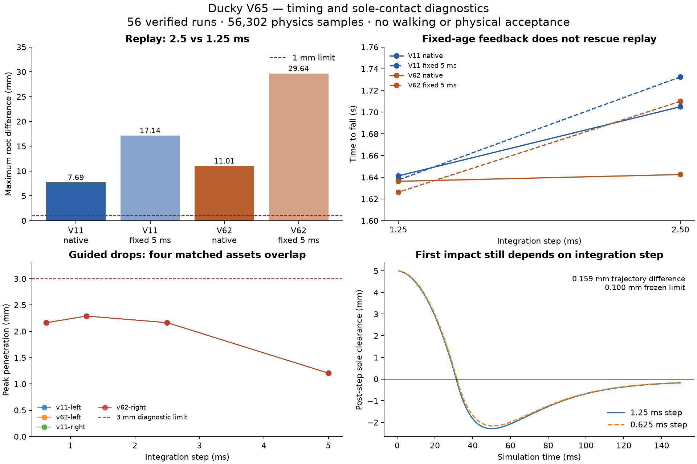

# V65 results: feedback age does not resolve timestep sensitivity

**The planned investigation is complete; the numerical acceptance gates remain
open.** All 56 exposed cases and 56,302 physics samples are verified, with 28
exact repeat pairs. Sixteen replay controls exactly reproduce V64. No policy,
model or timestep is promoted, and no physical or carpet capability is claimed.

## Force-input intervention

The observer records every solver force/constraint array, its integration
interval, and the selected inputs of all **21,744 BAM updates**. Native feedback
uses solver fields aged 5/2.5/1.25 ms at the respective integration rates.
Fixed-age feedback selects the recorded 5 ms-old fields. Both use the reset
snapshot at time zero. Joint state, 50 Hz commands, 200 Hz BAM updates, 20 ms
target delay, original float32 actions and physical solver arrays stay intact.
These timestamps describe the simulation pipeline, not measured hardware latency.

Eight 5 ms controls passed exact initial/dynamic-array conformance before native
fine-step runs. Those eight runs also exactly reproduced V64 before the fixed-age
intervention launched. All twelve repeated replay conditions have byte-identical
initial arrays, dynamics, force snapshots and BAM-input records. Every phase used
the bounded coordinator and a fresh compute guard, with completed prerequisites
checked in the launch shell. No premature phase launch occurred.

| Model | Integration | Native endpoint | Fixed-age endpoint |
|---|---:|---:|---:|
| V11 | 5 ms | Completes 18 s | Identical 18 s |
| V11 | 2.5 ms | Falls 1.705 s | Falls 1.7325 s |
| V11 | 1.25 ms | Falls 1.64125 s | Falls 1.6375 s |
| V62 | 5 ms | Falls 2.505 s | Identical 2.505 s |
| V62 | 2.5 ms | Falls 1.6425 s | Falls 1.710 s |
| V62 | 1.25 ms | Falls 1.63625 s | Falls 1.62625 s |

V11's completed 5 ms replay still exceeds the unchanged 3 mm floor-penetration
gate at 3.974844 mm. Across the 2.5/1.25 ms common grid, maximum root differences
are 7.689/11.007 mm for native V11/V62, and **17.137/29.637 mm** for fixed-age
V11/V62, against a 1 mm limit. All four numerical screens fail; fixing force age
does not improve this agreement. All 24 full replay diagnostic results fail.
Zero internal loading/penetration in the recorded active prefixes does not admit
their missing duration. These are frozen-action diagnostics, not closed-loop
policy scores, and they do not isolate every possible interaction.

Evidence: [frozen protocol](PROTOCOL.md), [bank](feedback-bank.json),
[full replay audit](all-feedback-review.json),
[numerical comparisons](feedback-comparison.json).

## Matched sole-contact bench

Four static models preserve each asset's compiled sole vertices/faces exactly
and match source CAD within 1.309 nm. Both mesh variants use the same V11 HOME
feature pose and ankle mass/inertia: 0.0300246 kg left, 0.0300251 kg right.
The body is constrained by a vertical slide and dropped from 5 mm clearance.
It has no BAM, actuation, body shells or horizontal/rotational motion. This
isolates numerical contact response for an ankle load; it does not reproduce
whole-body support or calibrate carpet/sole compliance.

All 32 one-second runs finish and pass the declared finite-state, penetration,
settling and momentum checks. Every applied contact force is recorded, and the
independent audit reconstructs the Euler velocity/position update and impulse
balance. The largest total momentum residual is 6.584e-12 N s. All sixteen repeat
pairs have exact dynamics and contact traces.

| Integration | Left sole peak penetration | First loaded solver interval |
|---|---:|---:|
| 5 ms | 1.206360 mm | 30.000 ms |
| 2.5 ms | 2.165498 mm | 32.500 ms |
| 1.25 ms | 2.290474 mm | 32.500 ms |
| 0.625 ms | 2.163745 mm | 31.875 ms |

V11 and V62 agree in all eight matched cross-asset screens: largest position
difference is 5.091e-11 m in this guided test. This is numerical agreement
for these matched conditions, not proof of whole-robot contact equivalence.

**None of the four finest-step numerical screens passes.** The 1.25/0.625 ms
position difference is 0.159468 mm and penetration-peak difference is 0.126729 mm;
both exceed their frozen 0.1 mm limits. Impulse and onset-time screens pass.
For context, the 5/2.5 ms position difference is 0.998192 mm. Agreement of total
impulse and final settling does not establish agreement during impact.

Evidence: [static checks](bench-static.json), [frozen bank](bench-bank.json),
[force and state audit](bench-review.json), [comparisons](bench-comparison.json).

## Decision and next activity

Keep native BAM and all retained policies unchanged. The fixed-age intervention
is a diagnostic, not a proposed controller correction. The contact benchmark
still has unresolved discretization error even without BAM; contact mesh identity
is not the leading explanation within this specific guided test.

Next, freeze a cheap first-impact convergence study at **0.625, 0.3125 and
0.15625 ms**, including predefined impact-phase variations and the unchanged
soft-contact parameters. Use the analytic free-fall interval to audit the time
and incoming velocity of the first loaded contact; keep phase effects separate
from contact-response error. Require the unchanged 0.1 mm/impulse gates in every
declared bucket. Do not stiffen contacts or choose a favorable drop phase.

After that local numerical gate, check short full-robot windows around first
impact with complete copied solver/BAM/FIFO state and one variable group at a
time. A long open-loop replay is also sensitive to accumulated trajectory error;
neither survival nor an isolated bench pass can replace this check. Only then
select a numerical reference and run the queued immediate standing-policy
handoff. New training, daemon activation and broader terrain claims remain later.

## Verification and provenance

- Six snapshot/clock/isolation tests and three analytic impulse/missing-evidence
  tests pass. No workspace tooling was changed, so no full simulation regression
  was launched.
- All 2,252 artifacts in the closed V62, V63 and V64 manifests verify unchanged:
  [prior closure audit](prior-closure-review.json).
- No paid compute, hardware, daemon or policy activation. Bulk traces reside on
  UUID-verified `cerebro-old`: [storage receipt](storage.json).
- Diagnostic tracing affects timing. The inherited V64 performance label does
  not describe the added in-loop JSON encoding; those raw fields are preserved
  but excluded from runtime-budget claims: [scope correction](timing-scope-note.json).
- MuJoCo's [documented forward-dynamics pipeline](https://mujoco.readthedocs.io/en/stable/programming/simulation.html#forward-dynamics)
  computes derived dynamics before advancing the integrated state. The source
  and runtime are pinned; no extra forward call is inserted into the replay.

All protected final banks remain separate from this exposed diagnostic. Physics
accuracy, cross-engine transfer and carpet generalization still require their
respective evidence gates. Plots do not change acceptance.
