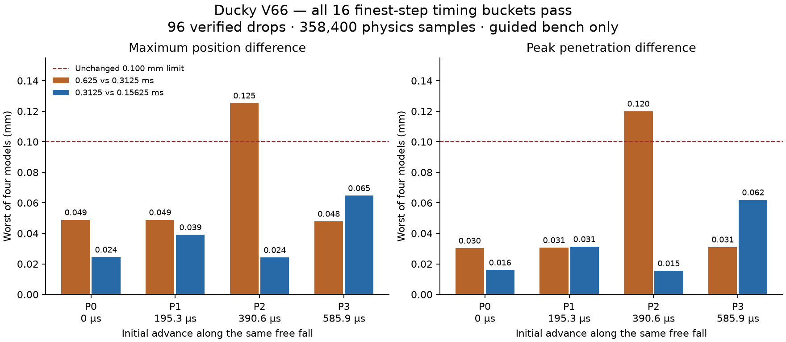

# V66: the guided first-impact numerical gate passes

**All 16 model/phase buckets pass at 0.3125 vs 0.15625 ms.** The frozen decision
admits 0.15625 ms as a candidate numerical reference for this isolated guided
ankle-drop bench. It does not change the full robot, BAM, training timestep or
retained policies, and it does not establish physical or carpet accuracy.

## What ran

All **96 one-second cases, 358,400 physics samples and 11,432 preimpact samples**
are independently verified. Forty-eight repeat pairs have exact initial arrays,
dynamics and contact traces. Eight controls exactly reproduce the prior V65
0.625 ms cases before the other 88 cases launch. Every case passes both the
inherited diagnostic and the new analytic free-fall audit. Seven focused tests
pass, and all 24 matched cross-asset comparisons pass.

The four V65 models use V11/V62 sole meshes for each foot with matched V11 ankle
inertia and a vertical guide. Steps are 0.625, 0.3125 and 0.15625 ms. Four starts
advance along the same analytic free-fall trajectory by 0, 0.1953125, 0.390625
and 0.5859375 ms. They preserve impact energy/continuous incoming velocity and
cover four quarter-step phases at the finest rate. Actual initial states are
byte-identical across rates and repeats within each of the sixteen buckets.
No contact softness, friction, geometry, mass or acceptance limit changed.

## Frozen numerical result

Each row reports the worst result across all four models at that phase. The
underlying decision checks every individual bucket and both repeats, without
averaging or shifting trajectories in time.

| Phase | Initial advance | 0.625/0.3125 ms position difference | 0.3125/0.15625 ms position difference |
|---|---:|---:|---:|
| P0 | 0 ms | 0.048858 mm | 0.024429 mm |
| P1 | 0.1953125 ms | 0.048858 mm | 0.039092 mm |
| P2 | 0.390625 ms | **0.125349 mm — fails** | 0.024190 mm |
| P3 | 0.5859375 ms | 0.047900 mm | 0.064698 mm |

The finest pair's largest position difference is **0.064698 mm**, and largest
penetration-peak difference is **0.061970 mm**, both below the unchanged 0.1 mm
limits. All sixteen impulse and contact-onset comparisons also pass: maximum
impulse difference is 7.813e-11 of m*g*T, and onset differs by at most 0.15625 ms
against the inherited 1.25 ms screen. This is pairwise numerical agreement
within the frozen envelope, not proof of an exact continuous-time solution.

The preceding 0.625/0.3125 ms pair passes only 12/16 buckets. P2 fails both
position and peak-penetration limits on every model. Nominal phase P0 would
have hidden that failure. The result supports retaining the fine offline
reference, not declaring the coarser rate adequate for every impact phase.

## First-contact audit

Every observed first loaded contact matches the first nonpositive clearance
predicted by the exact semi-implicit Euler free-fall sequence. Before that load,
maximum position and velocity residuals are 4.337e-18 m and 4.719e-16 m/s.
These are algebraic checks of the numerical trajectory, not physical metrology.

Across all rates/phases, the largest onset error relative to analytic continuous
free fall is 0.286919 ms and largest incoming velocity error is 0.002815 m/s.
Both remain within their preregistered one-step bounds. The independent checker
also reconstructs every post-contact Euler state update from applied contact
forces, including the nonzero initial momentum. The largest total impulse/
momentum residual is 3.076e-11 N s. All cases complete, settle, stay below 3 mm
penetration (maximum 2.252134 mm), and have no simulator warnings or actuation.

The analytic derivation is consistent with MuJoCo's
[numerical integration documentation](https://mujoco.readthedocs.io/en/stable/computation/index.html#numerical-integration).
It applies here because the guided body's mass is constant and free fall has
zero damping, actuation or contact force. It cannot be applied unchanged to the
articulated robot during BAM/contact interaction.

## Next: short full-robot impact windows

The first loaded floor contact in both V65 5 ms nominal robot traces starts at
0.040 s. Reproduce the prefix and capture a complete checkpoint at 0.035 s,
then freeze a 0.035–0.135 s impact window in both models. Existing position/
velocity traces alone are insufficient to reconstruct full solver/BAM state.

First require exact 5 ms clone controls against V65, including active contacts,
motor/friction updates and original action bytes. Preserve the full solver state
and its warm start, BAM targets/previous-torque history, applied model damping/
friction and FIFO contents. MuJoCo documents the importance of warm starts for
[exact state replay](https://mujoco.readthedocs.io/en/stable/programming/simulation.html#warmstarts).

Then isolate plant/contact integration using the same recorded motor, friction
and damping schedule at the fixed 200 Hz clock. Compare short windows at the
fine candidate steps with the existing robot numerical limits and physics-rate
contact telemetry. Frozen actuator output is an explicit diagnostic intervention,
not a new controller. Re-enable live BAM feedback only as a separately frozen
subsequent stage. This separates plant error from feedback amplification before
a new full-robot reference is selected.

Immediate standing-policy handoff follows those checks. Neither this guided
bench pass nor the earlier open-loop falls substitute for a closed-loop standing
or walking score. Training and physical/terrain admission remain later gates.

## Evidence

- [Frozen protocol](PROTOCOL.md) and [479-input bank](bank.json).
- [Exact control audit](controls-review.json), [full audit](all-review.json),
  [initial-state coverage](initial-state-coverage.json), [comparisons](comparison.json).
- All V65 artifacts remain unchanged; final closure audit also checks V62–V64.
- New bulk traces use the UUID-verified external drive: [storage receipt](storage.json).
- Local serial simulation only; no paid instance, hardware, daemon, policy
  activation, or protected final-bank access. No workspace tooling changed.

The benchmark is a constrained CAD ankle load, not the whole robot's supported
mass or measured material compliance. The closed V65 failure remains preserved.
