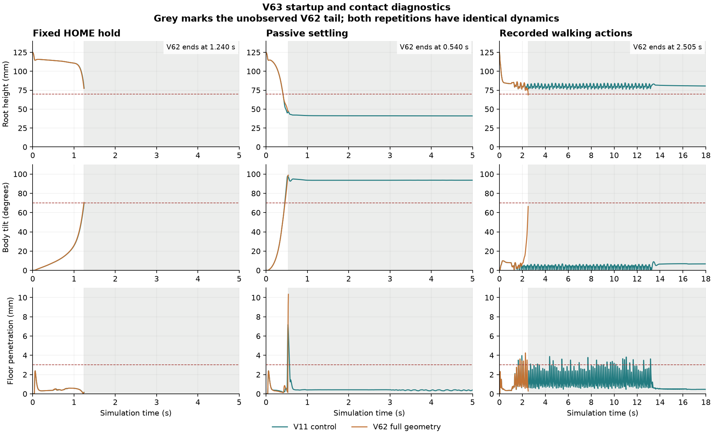

# V63 startup, passive settling and retained-action replay

**All twelve planned probes completed their declared run or terminal stop, and
the evidence is verified. The full V62 model does not pass this diagnostic bank.**
Both retained V11 replays reproduce the original 18-second states, targets and
physics-rate torques exactly. V62 receives those same action bytes and falls at
2.505 seconds. This is an open-loop model comparison, not a closed-loop policy
score: no actor observes and corrects the new trajectory.

## Measured outcomes

Each row below has two executions with byte-identical initial arrays and dynamics.

| Probe | V11 control | V62 full geometry | Decision |
|---|---|---|---|
| Fixed HOME, 5 s requested | Falls at 1.245 s, tilt 70.270° | Falls at 1.240 s, tilt 70.493° | Static HOME is not a stable startup controller on either model. |
| Passive, 5 s requested | Completes 5 s and settles; maximum floor penetration 7.187 mm, joint overshoot .044857 rad | Stops at .540 s on 10.336 mm floor penetration; maximum internal penetration 1.715 mm; peak internal normal load 45.036 N | Both fail the frozen numeric criteria. Candidate settling is incomplete. Passive resting loads are not classified as upright bracing. |
| Frozen 18 s stand/walk/stop actions | Completes; all 900 qpos/qvel/target samples and 3,600 torque vectors exactly reproduce the source | Falls at 2.505 s, root height 68.774 mm; no stop phase observed | Candidate replay fails. Its observed prefix has zero internal body load and penetration, which cannot certify the missing tail. |

The new 3 mm floor-penetration diagnostic also rejects the retained V11 replay:
its maximum is 3.975 mm. This new negative is recorded separately; the original
V30 actor scores are unchanged. No threshold is relaxed after seeing results.
The twelve cases therefore produce **0/12 new diagnostic passes**, with two exact
reference-replay conformance passes. Execution, conformance and behavior outcomes
are distinct fields in the receipts.

The plots show repetition one; repetition two has identical dynamics. Grey areas
are unobserved candidate tails. Falling is allowed in the passive probe, but its
penetration, settling and numerical gates remain required. The passive model has
zero electrical torque with BAM mechanical friction and rotor inertia; it does
not claim to reproduce powered-off hardware.

## What the first divergence shows

V62 first loads the added left foot-shell/floor pair at **1.475 s** and the right
at **1.630 s**. Root displacement differs from V11 by more than .1 mm at 1.010 s
and 1 mm at 1.730 s; the maximum joint-angle difference exceeds .1° at 1.100 s and
1° at 1.820 s. These are posthoc localization points, not acceptance thresholds.
The added shell contacts precede the fall, but that ordering does not prove cause.

Initial body masses and BAM armature/damping/friction arrays are identical.
Raw quaternion signs differ while their rotation matrices match exactly;
body-frame inertia tensors differ by at most 2.8000002e-11 kg·m² and COM locations
by .1 micrometre. These small export differences remain part of the comparison.
An open-loop replay can amplify small changes, so their contribution must be
isolated before blaming the new contacts or retraining a policy. No evidence here
shows internal head bracing caused the active replay failure.

The passive hard-stop witness is the floor against
`jaw_soft_11_top_head_shell_collision` at .540 s. Its deepest internal contact is
between `hip_l_2_1_hip_l_collision` and `ankle_right_1_ankle_right_collision`
at .475 s. This is a collapsed impact state, outside V62's copied-pose geometry
bank; that earlier static result remains unchanged.

## Compute cost

V62's replay physics step has median .314 ms in repetition one, compared with
.022 ms for V11. The instrumented V62 replay control p99 is **2.400–2.612 ms**
across repeats, with no observed 20 ms deadline misses. Both runs end at 2.505 s,
so the full-duration performance gate remains unpassed. HOME p99 is 3.257–3.615 ms.
The passive impact has one missed 20 ms deadline out of 27 completed intervals in
each repeat; its short, terminated prefix cannot establish sustained performance.

Control timing includes BAM, four physics steps, contact reads and state copying;
it excludes file encoding. Compilation and setup are outside per-step timings.
This is serial local throughput, not actual daemon or hardware scheduling proof.
The observed active prefix gives no reason to optimize hull count before resolving
the contact/startup questions.

## Next activity

**First isolate foot–ground contact and numerical contact response.** Preserve the
V63 negatives and freeze a small action-preserving comparison before intervention:

1. Audit sole versus foot-shell CAD support geometry at the first added contact.
   Separate meaningful geometry differences from sign-equivalent quaternions and
   tiny export roundoff. Use one changed property group per comparison.
2. Run a clearly rejected-for-deployment contact counterfactual to determine
   whether the added foot-shell floor pairs materially change the divergence;
   retain every other body pair. A masked diagnostic is not an accepted model.
3. Check contact/impact convergence with fixed actor actions and physical command
   delay, preserving 50 Hz control and 200 Hz BAM updates while varying only the
   integrator subdivision. Record effective contact parameters and actual loads.
   Investigate softness and integration jointly before changing training.
4. Once the model question is resolved, test immediate standing-policy handoff
   from initialization. Fixed HOME has failed on both models. Official daemon
   integration and a new closed-loop walk/turn/stop bank remain later work.

MuJoCo represents contact compliance through solver parameters. Its guidance
connects contact softness, penetration and integration step size, and recommends
a positive-format contact time constant of at least twice the simulation step.
That supports a controlled contact/convergence audit; it does not supply measured
robot calibration or justify arbitrary stiffening until a rollout looks good.
[Official MuJoCo modeling guidance](https://mujoco.readthedocs.io/en/stable/modeling.html#solver-parameters).

## Verification and receipts

- Seven focused probe tests and all 141 fast workspace tests pass.
- Independent review verifies all **11,412 physics samples**, all six repeat
  pairs, retained action bytes, manually reconstructed FIFO targets, state-array
  correspondence, zero passive actuator forces and reaggregated contact loads.
- Two V11 replay controls have exactly zero qpos, qvel, target and torque error.
- All twelve child processes finish without timeout or execution error; ordinary
  terminal failures are retained as failed cases, not process failures.
- The output root is the UUID-verified external drive, linked through `runs/`.
  No model/policy activation, paid compute, hardware or training was used.

Read `bank.json` and `PROTOCOL.md` for the frozen definitions, `review.json` for
independent checks, `control-review.json` for candidate-launch conformance, and
`runs/<case>/result.json`, `dynamics.npz`, `timing.npz` and `physics.jsonl.gz` for
actual case evidence. The `verification_passed` field means evidence integrity;
it does not override any failed diagnostic component. Physical calibration,
terrain generalization and full-model closed-loop walking remain unverified.
